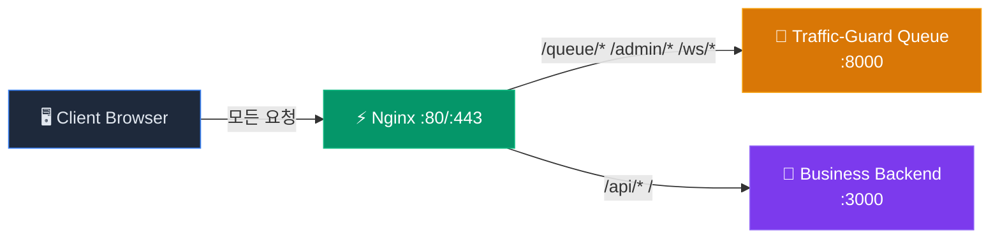

# 🚦 Traffic-Guard 하류(Downstream) 시스템 연동 가이드라인

> **Traffic-Guard** 가상 대기실 미들웨어와 하류 비즈니스 백엔드를 연동하기 위한 종합 가이드입니다.
> 본 문서를 통해 CORS 이슈 해결, JWT 검증, 부하 피드백, 우회 차단, 토큰 만료 처리를 구현할 수 있습니다.

---

## 📋 목차

1. [단일 도메인 Reverse Proxy 구성 가이드](#1-단일-도메인-reverse-proxy-구성-가이드)
2. [대기열 JWT 검증 가이드](#2-대기열-jwt-검증-가이드)
3. [부하 메트릭 피드백 가이드](#3-부하-메트릭-피드백-가이드)
4. [우회 접속 차단 가이드](#4-우회-접속-차단-가이드)
5. [토큰 만료/완료 처리 가이드](#5-토큰-만료완료-처리-가이드)
6. [빠른 시작 체크리스트](#6-빠른-시작-체크리스트)

---

## 1. 단일 도메인 Reverse Proxy 구성 가이드

### 1.1 아키텍처 개요

Traffic-Guard는 **Nginx를 단일 도메인 게이트웨이**로 사용하여, 대기열 미들웨어와 하류 비즈니스 백엔드를 하나의 도메인 아래 경로(path) 기반으로 라우팅합니다.

이 구성의 핵심 장점:

- **CORS 이슈 완전 해결**: 브라우저 Same-Origin Policy를 만족하므로 CORS 헤더 설정이 불필요
- **쿠키/세션 공유**: 동일 도메인이므로 쿠키가 자연스럽게 공유됨
- **인증서 관리 단순화**: SSL 인증서를 Nginx 한 곳에서만 관리

### 1.2 트래픽 흐름도

