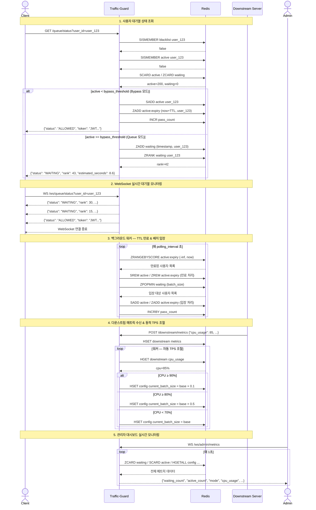

# Traffic-Guard

**가상 대기열(Virtual Waiting Room) 미들웨어**

트래픽 급증으로부터 서비스를 보호하는 FastAPI 기반 대기열 관리 시스템입니다.

---

## ✨ 주요 기능

| 기능                                   | 설명                                             |
| -------------------------------------- | ------------------------------------------------ |
| **가변 가상 대기열**                   | 트래픽 상황에 따라 Bypass / Queue 모드 자동 전환 |
| **Active User TTL 관리**               | 활성 사용자 자동 만료 및 슬롯 회수               |
| **다운스트림 부하 인식 동적 TPS 조절** | 하류 서버 CPU 사용률에 따라 배치 크기 자동 조절  |
| **실시간 관리자 대시보드**             | WebSocket 기반 실시간 모니터링 UI                |
| **실시간 클라이언트 대기열 페이지**    | WebSocket 기반 대기 순번 실시간 업데이트         |
| **JWT 통과 검증 토큰**                 | 대기열 통과 시 서명된 JWT 토큰 발급              |
| **블랙리스트**                         | 특정 사용자/IP 접근 차단                         |

---

## 🏗️ 기술 스택

- **Backend**: Python 3.10+, [FastAPI](https://fastapi.tiangolo.com/)
- **Queue Store**: [Redis](https://redis.io/) (Sorted Set, Set, Hash 활용)
- **Token**: [PyJWT](https://pyjwt.readthedocs.io/)
- **Server**: [Uvicorn](https://www.uvicorn.org/)
- **Container**: Docker Compose

---

## 📁 프로젝트 구조

```
fastGateway/
├── main.py                  # 메인 애플리케이션 (API, WebSocket, Background Worker)
├── simulate_traffic.py      # 동시 접속 부하 테스트 스크립트
├── docker-compose.yaml      # Redis 컨테이너 설정
├── Downstream_Guideline.md  # 다운스트림 연동 가이드
├── Test Guide.md            # 테스트 가이드
└── templates/
    ├── dashboard.html       # 관리자 대시보드 UI
    └── queue.html           # 사용자 대기열 페이지 UI
```

---

## 🚀 빠른 시작

### 1. 사전 요구사항

- Python 3.10+
- Docker & Docker Compose (Redis 실행용)

### 2. Redis 실행

```bash
docker-compose up -d
```

Redis가 `localhost:6379`에서 실행됩니다.

### 3. Python 의존성 설치

```bash
pip install fastapi uvicorn redis pyjwt websockets
```

### 4. 서버 실행

```bash
python main.py
```

서버가 `http://0.0.0.0:8000`에서 시작됩니다 (hot-reload 활성화).

### 5. 접속 확인

| URL                                     | 설명                         |
| --------------------------------------- | ---------------------------- |
| `http://localhost:8000/docs`            | Swagger API 문서 (자동 생성) |
| `http://localhost:8000/admin/dashboard` | 관리자 대시보드              |
| `http://localhost:8000/queue/page`      | 사용자 대기열 페이지         |

---

## 🔧 환경 변수

| 변수         | 기본값                                  | 설명                                      |
| ------------ | --------------------------------------- | ----------------------------------------- |
| `REDIS_HOST` | `localhost`                             | Redis 호스트 주소                         |
| `REDIS_PORT` | `6379`                                  | Redis 포트                                |
| `JWT_SECRET` | `super-secret-key-change-in-production` | JWT 서명 비밀키 (**운영 시 반드시 변경**) |

---

## ⚙️ 런타임 설정 (Redis 기반)

Admin API (`POST /admin/config`)를 통해 런타임에 동적으로 변경 가능합니다.

| 항목                      | 기본값  | 설명                                                |
| ------------------------- | ------- | --------------------------------------------------- |
| `bypass_threshold`        | `500`   | 이 수 이하의 활성 사용자일 때 대기열 없이 바로 통과 |
| `active_ttl_sec`          | `300`   | 활성 사용자 슬롯 유지 시간 (초)                     |
| `base_batch_size`         | `50`    | 기본 배치 크기 (한 주기당 입장 인원)                |
| `current_batch_size`      | `50`    | 현재 적용 중인 배치 크기 (동적 조절됨)              |
| `polling_interval`        | `1`     | 백그라운드 워커 실행 주기 (초)                      |
| `token_ttl_sec`           | `60`    | 발급된 JWT 토큰 유효 시간 (초)                      |
| `is_paused`               | `false` | `true`로 설정 시 대기열 입장 일시 중지              |
| `auto_throttling_enabled` | `true`  | 다운스트림 CPU에 따른 자동 TPS 조절 활성화          |

---

## 📡 API 명세

### A. Public API — 대기열 상태 조회

#### `GET /queue/status?user_id={user_id}`

사용자의 대기열 상태를 조회합니다.

**응답 예시 (바로 통과):**

```json
{
    "status": "ALLOWED",
    "token": "eyJhbGciOiJIUzI1NiIs..."
}
```

**응답 예시 (대기 중):**

```json
{
    "status": "WAITING",
    "rank": 42,
    "estimated_seconds": 8.4
}
```

**응답 예시 (차단됨):**

```json
// HTTP 403
{ "detail": "Access denied: user is blacklisted" }
```

---

### B. Client WebSocket — 실시간 대기열 상태

#### `WS /ws/queue/status?user_id={user_id}`

WebSocket 연결을 통해 대기 순번을 실시간으로 수신합니다. 입장 허용 시 JWT 토큰과 함께 `ALLOWED` 메시지를 받고 연결이 종료됩니다.

---

### C. Downstream Feedback API

#### `POST /downstream/metrics`

다운스트림 서버의 상태 메트릭을 수신하여 동적 TPS 조절에 활용합니다.

**요청 Body:**

```json
{
    "server_id": "web-01",
    "cpu_usage": 75.5,
    "active_connections": 1200,
    "http_5xx_rate": 0.02
}
```

#### `POST /queue/expire-token`

활성 사용자의 슬롯을 명시적으로 해제합니다.

**요청 Body:**

```json
{ "user_id": "user_123" }
```

---

### D. Admin API

#### `POST /admin/config`

런타임 설정을 업데이트합니다.

**요청 Body 예시:**

```json
{
    "bypass_threshold": 300,
    "base_batch_size": 100,
    "is_paused": true
}
```

#### `POST /admin/queue/flush`

모든 대기열 데이터를 즉시 초기화합니다.

#### `POST /admin/blacklist`

사용자 ID 또는 IP를 블랙리스트에 추가합니다.

**요청 Body:**

```json
{
    "user_id": "malicious_user",
    "ip": "192.168.1.100"
}
```

---

### E. Admin WebSocket — 실시간 모니터링

#### `WS /ws/admin/metrics`

관리자 대시보드에 실시간 메트릭을 스트리밍합니다 (1초 간격).

**수신 데이터 예시:**

```json
{
    "waiting_count": 150,
    "active_count": 480,
    "mode": "BYPASS",
    "bypass_threshold": 500,
    "current_tps": 50,
    "base_batch_size": 50,
    "active_ttl_sec": 300,
    "is_paused": false,
    "auto_throttling_enabled": true,
    "cpu_usage": 65.2,
    "active_connections": 800,
    "http_5xx_rate": 0.01,
    "total_passed": 12450,
    "timestamp": 1695300000.0
}
```

---

### F. UI 페이지

| Endpoint               | 설명                        |
| ---------------------- | --------------------------- |
| `GET /admin/dashboard` | 관리자 실시간 대시보드 HTML |
| `GET /queue/page`      | 사용자 대기열 페이지 HTML   |

---

## 🔄 동적 TPS 조절 로직

백그라운드 워커가 다운스트림 서버의 CPU 사용률을 기반으로 배치 크기를 자동 조절합니다.

| CPU 사용률 | 적용 배치 크기        |
| ---------- | --------------------- |
| ≥ 90%      | `base × 0.1` (최소 1) |
| ≥ 80%      | `base × 0.5` (최소 1) |
| < 70%      | `base` (기본값 복원)  |
| 70~80%     | 현재 값 유지          |

---

## 🧪 부하 테스트

동시 접속 시뮬레이션 스크립트가 포함되어 있습니다.

```bash
pip install websockets
python simulate_traffic.py
```

기본적으로 50명의 가상 사용자가 동시에 WebSocket으로 대기열에 진입합니다. `TOTAL_USERS` 변수를 수정하여 동시 접속 수를 변경할 수 있습니다.

---

## 🗄️ Redis 데이터 구조

| Key                        | Type       | 용도                                       |
| -------------------------- | ---------- | ------------------------------------------ |
| `queue:waiting`            | Sorted Set | 대기 사용자 (score = 진입 타임스탬프)      |
| `queue:active`             | Set        | 현재 활성 사용자                           |
| `queue:active:expiry`      | Sorted Set | 활성 사용자 만료 시각 (score = 만료 epoch) |
| `queue:config`             | Hash       | 런타임 설정값                              |
| `queue:metrics:downstream` | Hash       | 다운스트림 서버 메트릭                     |
| `queue:metrics:pass_count` | String     | 총 통과 사용자 수 (카운터)                 |
| `queue:blacklist`          | Set        | 차단된 사용자/IP 목록                      |

---

## 📊 시퀀스 다이어그램

### 사용자 대기열 진입 및 통과 흐름



---

## 📜 라이선스

이 프로젝트는 내부 사용 목적으로 작성되었습니다.
